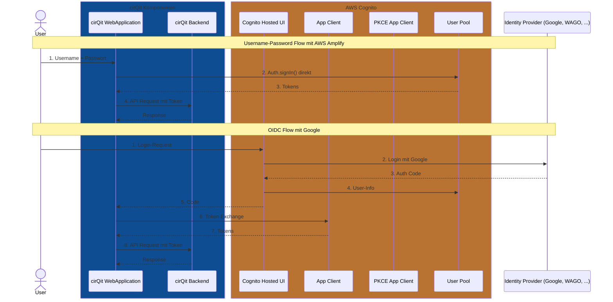

# AWS Cognito Authentication Flows

Dieses Diagramm zeigt die vier verschiedenen Authentifizierungsflows, die alle mit AWS Cognito arbeiten, in einer vereinfachten Darstellung. Es verdeutlicht, wie die verschiedenen Flows dieselben Cognito-Ressourcen gemeinsam nutzen.

## Hinweise zu den Ressourcen

- **User Pool**: Zentrale Nutzerdatenbank, die von allen Flows gemeinsam genutzt wird
- **App Client**: Wird von OIDC und Client Credentials genutzt
- **PKCE App Client**: Spezieller App Client nur für den PKCE-Flow
- **Identity Provider**: Für föderierte Authentifizierung (z.B. Google) im OIDC-Flow
- **Resource Server Configuration**: Definiert Scopes für Client Credentials
- **Hosted UI**: Anmeldeoberfläche für OIDC und PKCE

## Farblegende

- cirQit Komponenten (WebApp, API, Open API): Dunkelblau
- AWS Cognito Komponenten: AWS-Orange
