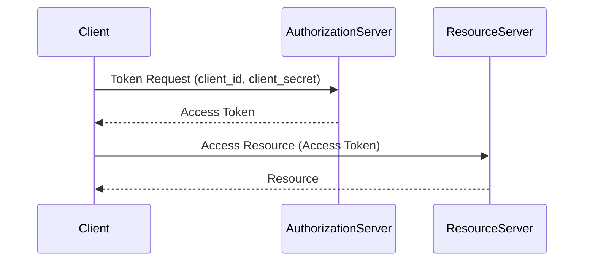

# Examples

## obtain client_secret
The client secret is provided in https://app.cirqit.cloud/#/account 

## OAuth 2.0 Client Credentials flow

```mermaid
sequenceDiagram
    participant Client
    participant AuthorizationServer
    participant ResourceServer

    Client->>AuthorizationServer: Token Request (client_id, client_secret)
    AuthorizationServer-->>Client: Access Token
    Client->>ResourceServer: Access Resource (Access Token)
    ResourceServer-->>Client: Resource
```

