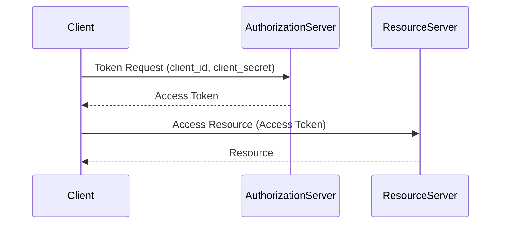

# Examples

## OAuth 2.0 Client Credentials flow

```mermaid
sequenceDiagram
    participant Client
    participant AuthorizationServer
    participant ResourceServer

    Client->>AuthorizationServer: Token Request (client_id, client_secret)
    AuthorizationServer-->>Client: Access Token
    Client->>ResourceServer: Access Resource (Access Token)
    ResourceServer-->>Client: Resource
```

PKCE workflow: 

https://developer.reachfive.com/docs/flows/authorization-code-pkce.html

