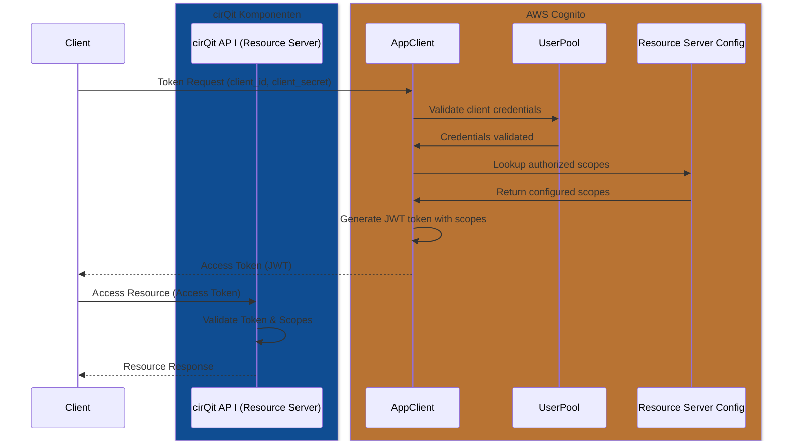

# Examples

## obtain client_secret
The client secret is provided in https://app.cirqit.cloud/#/account 

## OAuth 2.0 Client Credentials flow

## Erklärung der Komponenten

- **Client**: Die Anwendung, die auf die cirQit API zugreifen möchte
- **AppClient**: Die in Cognito konfigurierte Client-Anwendung
- **UserPool**: Der Benutzerpool, der die Validierung der Client-Credentials durchführt
- **Resource Server Config**: Die Konfiguration innerhalb von Cognito, die die verfügbaren Scopes definiert
- **cirQit API**: Die eigentliche API, die die Ressourcen bereitstellt und das Token validiert
