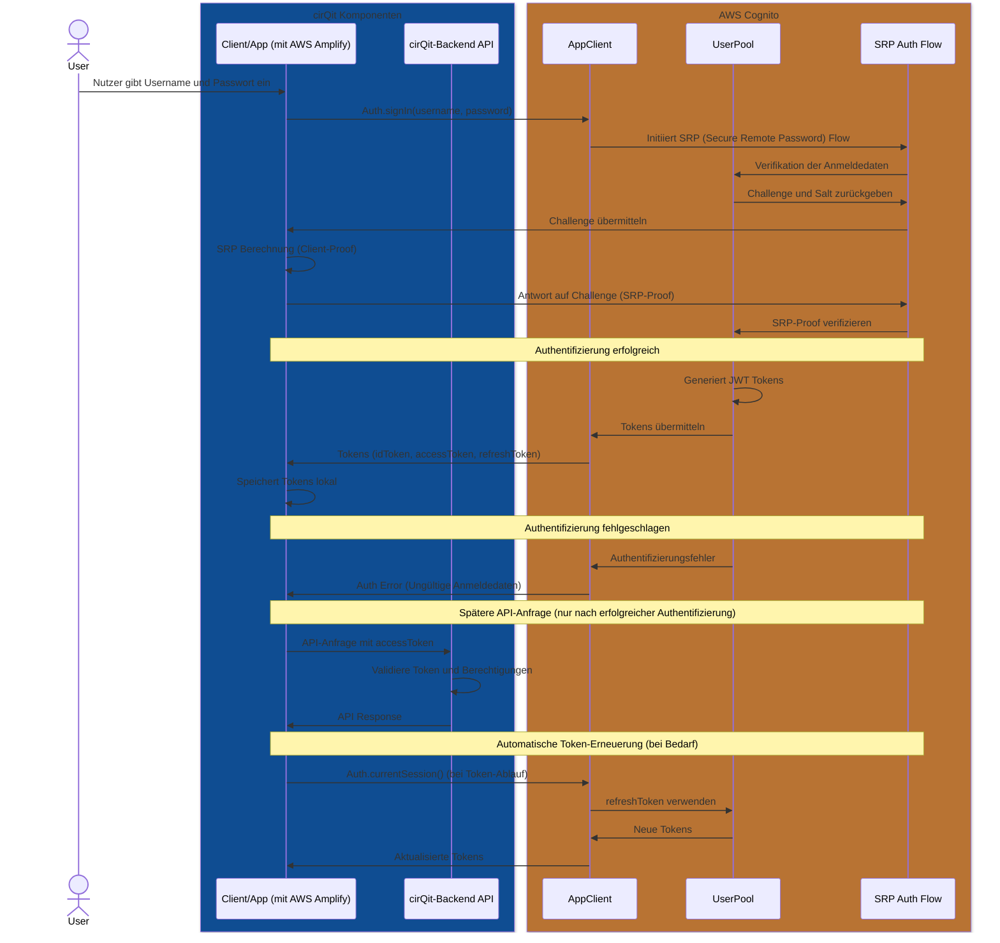

# Username-Password Authentication Flow mit AWS Amplify

Dieser Flow zeigt die direkte Authentifizierung mit Benutzername und Passwort unter Verwendung von AWS Amplify und Cognito.

## Username-Password Authentication Flow

## Besonderheiten des SRP-Protokolls

Der Username-Password Flow in AWS Cognito verwendet das Secure Remote Password (SRP) Protokoll, um die Anmeldedaten sicher zu übertragen:

1. Das Passwort wird niemals als Klartext übertragen
2. Eine Challenge-Response-Mechanik schützt vor Replay-Attacken
3. Sowohl Client als auch Server authentifizieren sich gegenseitig

AWS Amplify implementiert das SRP-Protokoll automatisch, sodass du dich nicht um die kryptografischen Details kümmern musst.
